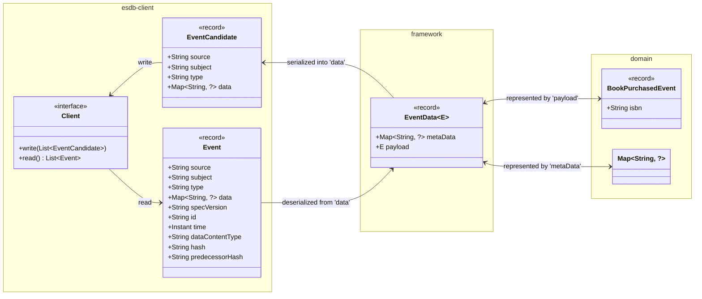

Events published or consumed using the CQRS/ES Framework are stored within the Event-Sourcing DB, which in turn
uses the [Cloud Events Specification](https://github.com/cloudevents/spec) as a basis for representing events in JSON.

The following diagram depicts how these events are represented within the `esdb-client` and `framework`
[modules](../modules/index.md) and an exemplary application `domain`:

The diagram includes both the _write_ and _read_ representations with the `BookPurchasedEvent` as the exemplary 
domain event.

## Events and EventCandidates

Within the `esdb-client` module events are distinguished with respect to whether they were read from (`Event`)
or intended to be written (`EventCandidate`) to the event store. Both share a common set of attributes:

*   a `source` identifying the system or service, which published the event, e.g. `tag://service:spring:library`
*   a `subject` identifying the domain entity that the event _belongs_ to, e.g. `/books/ab9c7d71-9a5e-4664-8b75-73f4d04cac5e`
*   a `type` representing the event type, e.g. `com.example.book.purchased.v1`
*   the actual event `data` represented as generic map, e.g. any valid JSON content

??? info "Deviations from Cloud Events Specification"
    Both `EventCandidate` and `Event` are in-memory representations of the JSON read from or written to the event store.
    They do __not__ strictly adhere to the structure and naming of attributes defined within the 
    [Cloud Events Specification](https://github.com/cloudevents/spec) or the Event-Sourcing DB API.

An `EventCandidate` represents an intent for publishing a new event to the event store and thus is limited to the
aforementioned common set of attributes. An `Event`, read from the event store, is an _enriched_ representation
additionally containing:

*   a `specVersion` identifying the version of the [Cloud Events Specification](https://github.com/cloudevents/spec)
*   an `id` which uniquely identifies the event within the global event stream of the event store, e.g. an auto-incremented number
*   the `time` the event was written to the event store
*   a `dataContentType`, which is fixed `application/json`
*   a `hash` and `predecessorHash` representing the hashes of the overall event and its predecessor

## Event Payload and Metadata

Within the `framework` the `data` of `EventCandidate` and `Event`, respectively, is transformed into
an `EventData` representation with:
*   the `payload` representing the actual Java event object, e.g. `BookPurchasedEvent`
*   the `metaData` containing additional meta-data accompanying the event

!!! info
    The [Cloud Events Specification](https://github.com/cloudevents/spec) is constrained to having only a single
    `data` attribute per event. Hence, the `framework` uses `EventData` to distinguish between the actual
    Java object payload and its optional meta-data.

## Application Events

The event persistence within the `framework` module is focused on writing and reading Java object events, that
can be serialized to and deserialized from JSON. Accordingly, `EventData` is used as a wrapper for representing the
object payload and its optional meta-data. The event `type` indicates which Java class to use for deserializing
the events.
