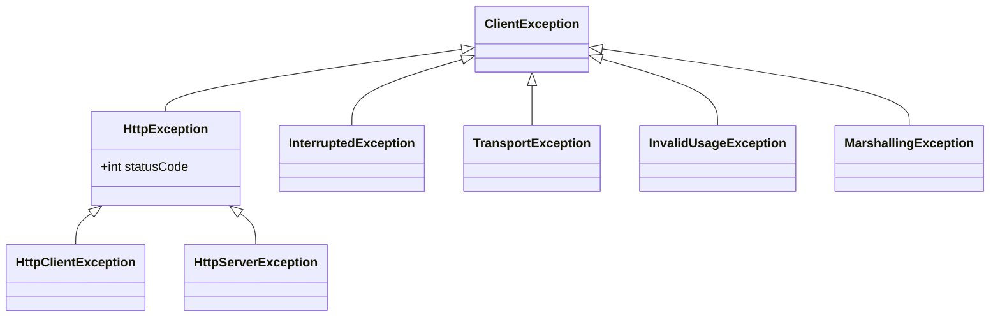
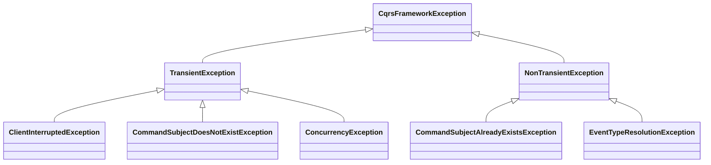

The [core modules](../modules/index.md#core) use different exception hierarchies, for expressing errors at runtime.

## Client Exceptions

The `esdb-client` module exposes the following exception hierarchy, when using `Client`{ title="com.opencqrs.esdb.client.Client" }
operations:

The following table describes, which error cases are represented by each of these exceptions:

| Exception Class                                                                                                              | Cause/Description                                                                    |
|------------------------------------------------------------------------------------------------------------------------------|--------------------------------------------------------------------------------------|
| `ClientException` { title="com.opencqrs.esdb.client.ClientException" }                                       | base class for all client-related exceptions, extending `java.lang.RuntimeException` |
| `HttpException` { title="com.opencqrs.esdb.client.ClientException.HttpException" }                           | base class for HTTP status codes representing errors                                 |
| `HttpClientException` { title="com.opencqrs.esdb.client.ClientException.HttpException.HttpClientException" } | represents HTTP 4xx client errors                                                    |
| `HttpServerException` { title="com.opencqrs.esdb.client.ClientException.HttpException.HttpServerException" } | represents HTTP 5xx server errors                                                    |
| `InterruptedException` { title="com.opencqrs.esdb.client.ClientException.InterruptedException" }             | represents thread interruption                                                       |                                                      
| `TransportException` { title="com.opencqrs.esdb.client.ClientException.TransportException" }                 | represents network and connection errors                                             |
| `InvalidUsageException` { title="com.opencqrs.esdb.client.ClientException.InvalidUsageException" }           | represents invalid Client API usage, e.g. conflicting preconditions or options       |
| `MarshallingException` { title="com.opencqrs.esdb.client.ClientException.MarshallingException" }             | represents serialization/deserialization errors to/from JSON                         |

## Framework Exceptions

The `framework` module exposes the following exception hierarchy, when using any of its core components:

!!! note "Wrapped ClientException"
    As the module depends on the `esdb-client`, occurrences of `ClientException` and its subclasses are wrapped into 
    framework-specific exception classes, so code using only framework components can rely on this exception hierarchy.

The following table describes, which error cases are represented by each of these exceptions:

| Exception Class                                                                                                               | Cause/Description                                                                                                        |
|-------------------------------------------------------------------------------------------------------------------------------|--------------------------------------------------------------------------------------------------------------------------|
| `CqrsFrameworkException` { title="com.opencqrs.framework.CqrsFrameworkException" }                                     | base class for all framework related exceptions                                                                          |
| `TransientException` { title="com.opencqrs.framework.CqrsFrameworkException.TransientException" }                      | represents potentially recoverable errors, worth retrying                                                                |
| `ClientInterruptedException` { title="com.opencqrs.framework.client.ClientInterruptedException" }                      | represents client thread interruption                                                                                    |
| `CommandSubjectDoesNotExistException` { title="com.opencqrs.framework.command.CommandSubjectDoesNotExistException" }   | represents a missing or not yet existing target subject for a command execution                                          |
| `ConcurrencyException` { title="com.opencqrs.framework.client.ConcurrencyException" }                                  | represents a concurrency error while publishing events from a command execution, typically due to violated preconditions |
| `NonTransientException` { title="com.opencqrs.framework.CqrsFrameworkException.NonTransientException" }                | represents non-recoverable errors                                                                                        |
| `CommandSubjectAlreadyExistsException` { title="com.opencqrs.framework.command.CommandSubjectAlreadyExistsException" } | represents a conflict, because a target subject for a command execution already exists                                   |
| `EventTypeResolutionException` { title="com.opencqrs.framework.types.EventTypeResolutionException" }                   | represents unresolvable event type errors                                                                                |

Additionally, the following occurrences of `ClientException` are wrapped into `TransientException`{ title="com.opencqrs.framework.CqrsFrameworkException.TransientException" }:

-  `HttpClientException`{ title="com.opencqrs.esdb.client.ClientException.HttpException.HttpClientException" } with `statusCode` 408 (request timeout)
-  `HttpServerException`{ title="com.opencqrs.esdb.client.ClientException.HttpException.HttpServerException" }
-  `TransportException`{ title="com.opencqrs.esdb.client.ClientException.TransportException" }

The following occurrences of `ClientException` are wrapped into `NonTransientException`{ title="com.opencqrs.framework.CqrsFrameworkException.NonTransientException" }:

-  `HttpClientException`{ title="com.opencqrs.esdb.client.ClientException.HttpException.HttpClientException" } with any other 4xx `statusCode`
-  `HttpException`{ title="com.opencqrs.esdb.client.ClientException.HttpException" } for any non 4xx/5xx `statusCode`
-  `InvalidUsageException`{ title="com.opencqrs.esdb.client.ClientException.InvalidUsageException" }
-  `MarshallingException`{ title="com.opencqrs.esdb.client.ClientException.MarshallingException" }
