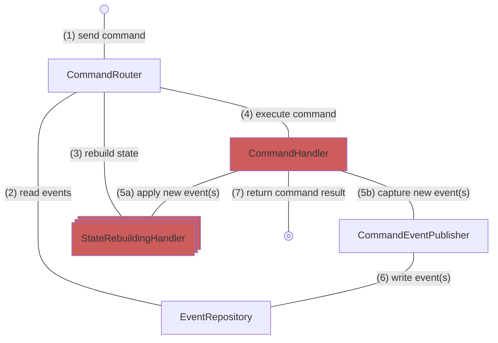
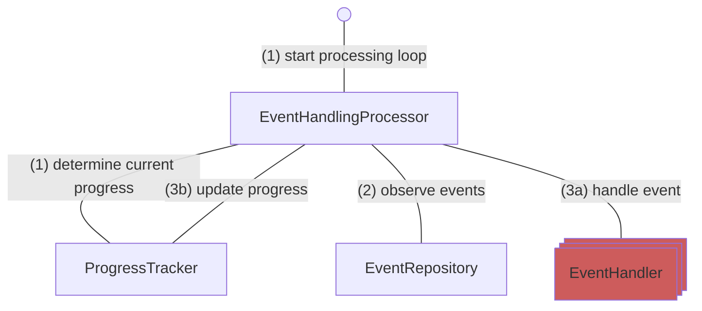

OpenCQRS offers three core extension points for application developers to implement their CQRS applications:
 
* `CommandHandler`{ title="com.opencqrs.framework.command.CommandHandler" } [definitions](command_handler/index.md) encapsulate the command handling logic for changing the system's state by publishing new events
* `StateRebuildingHandler`{ title="com.opencqrs.framework.command.StateRebuildingHandler" } [definitions](state_rebuilding_handler/index.md) support the reconstruction of write models from events, on which commands are executed
* `EventHandler`{ title="com.opencqrs.framework.eventhandler.EventHandler" } [definitions](event_handler/index.md) encapsulate event processing logic

## Command Handling

The following diagram shows s simplified command handling sequence involving the application specific extensions (highlighted in red): 

!!! tip
    For details about the command handling process, refer to [Command Router](../core_components/command_router/index.md).

## Event Processing

The following diagram shows a simplified asynchronous event processing loop involving the application specific extensions (highlighted in red):

!!! tip
    For details about the event processing loop, refer to [Event Handling Processor](../core_components/event_handling_processor/index.md).