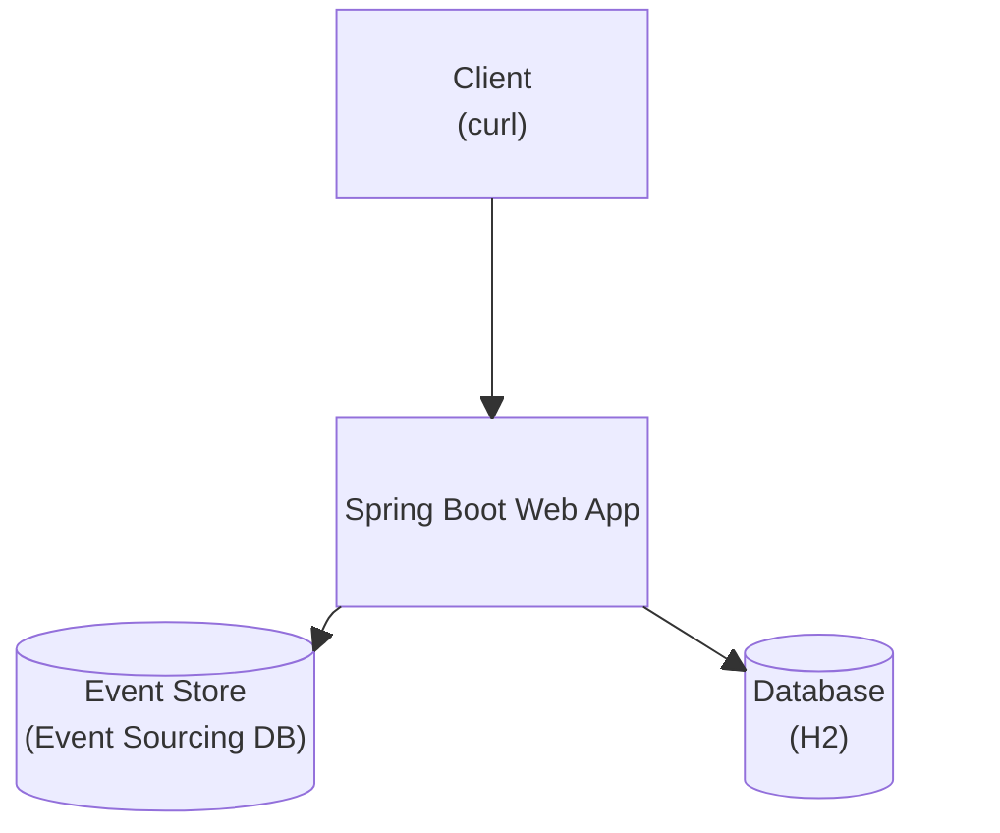
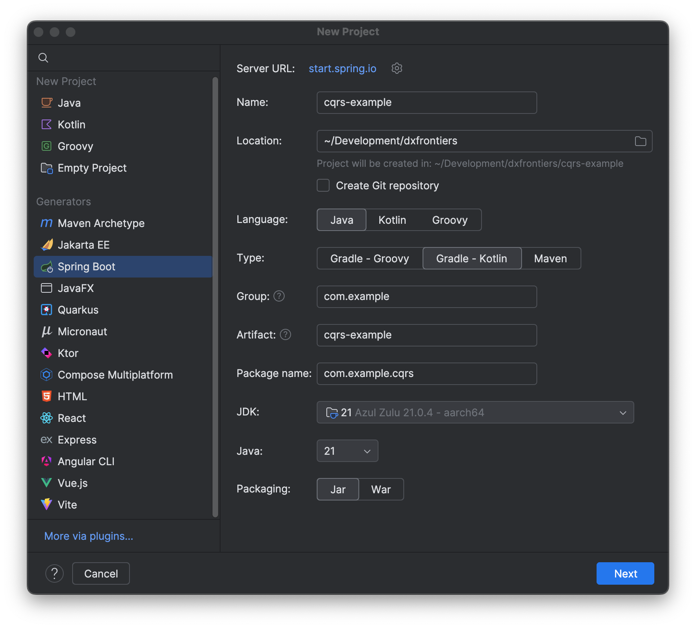

This tutorial will enable you to develop [Spring Boot](https://spring.io/projects/spring-boot) CQRS/ES applications 
by introducing you to the necessary building blocks used throughout this [Getting Started](/tutorials/README.md) series.
This involves the required infrastructure components and project dependencies. You will be
creating an initial, running Spring Boot application, that will be extended throughout the following
tutorials.

## Prerequisites

__In order to create and run the CQRS/ES Spring Boot App, you need the following tools:__

<div class="grid cards" markdown>

-   :simple-openjdk:{ .lg .middle } __JDK 21+__

    ---

    __Install__ a JDK with minimum version 21 to develop the app.

    [Download OpenJDK](https://jdk.java.net/)

-   :simple-intellijidea:{ .lg .middle } __IDE__

    ---

    __Use__ your preferred IDE, such as IntelliJ IDEA to write the code.

    [Download IntelliJ](https://www.jetbrains.com/idea/)

-   :simple-docker:{ .lg .middle } __Docker__

    ---

    __Install__ Docker to run additional, required backend services.

    [Download Docker](https://www.docker.com/products/docker-desktop/)

-   :simple-curl:{ .lg .middle } __curl__

    ---

    __Install__ curl (or any equivalent HTTP client) to test the application.

    [Download curl](https://curl.se/download.html)
</div>

## System Architecture Overview

The following diagram depicts the components used to build and test the application:



* The __Client__ represents real-world client applications interacting with the REST API provided by our Spring Boot application.
* The __Spring Boot Web App__ implements the domain and business logic to handle client requests.
* The [__Event-Sourcing DB__]({{ custom.esdb_homepage }}) is responsible for storing and reading the
  events published and consumed by the application, respectively. It represents the event store, which is the primary
  storage for our application.
* The __Database__ is a SQL database storing secondary data, i.e. data projections from existing events, and provides
  the necessary data for client queries.

!!! warning
    For a simplified setup of the infrastructure components an in-memory (H2) database will be used, which is fully integrated
    into the life-cycle of the Spring Boot application. This, however, implies that data stored therein will be lost upon
    restart of the application or has to be recreated from the primary storage (event store), if necessary.

## Running the Event-Sourcing DB

The Event-Sourcing DB is an infrastructure component that needs to be started independently of the Spring Boot app. You
can start it using Docker, as follows:

=== ":simple-linux: Linux / :simple-apple: MacOS"
    ```shell
    docker run --rm -it \
        --publish 3000:3000 \
        docker.io/thenativeweb/eventsourcingdb:{{ custom.esdb_version }} run \
        --api-token secret \
        --data-directory-temporary \
        --http-enabled=true \
        --https-enabled=false
    ```

=== " :fontawesome-brands-windows: Windows"
    ```shell
    docker run --rm -it ^
        --publish 3000:3000 ^
        docker.io/thenativeweb/eventsourcingdb:{{ custom.esdb_version }} run ^
        --api-token secret ^
        --data-directory-temporary ^
        --http-enabled=true ^
        --https-enabled=false
    ```

The database will be listening on TCP port `3000` with the access token `secret`, which can be verified by querying its `/ping` endpoint as follows:
```shell
curl --request GET --url "http://localhost:3000/api/ping"
```
If running correctly, this should yield `OK` as response.

## Creating an initial Spring Boot App

You will need to create a new Spring Boot application with __Spring Web__, __Spring Boot Actuator__, __H2 Database__, and __Spring Data JPA__ support:
 
* _Spring Web_ will enable us to implement REST API endpoints
* _Spring Boot Actuator_ provides us with health monitoring for the application and its infrastructure components
* _H2 Database_ will serve as secondary SQL data store
* _Spring Data JPA_ provides simpler data access to the H2 SQL database

Choose from any of the following options to create the application:
??? info "Spring Boot version"
    Spring Boot's version is constantly increasing. You may use any stable Spring Boot
    version newer than `3.4.2` as well, in the following.

=== ":simple-spring: Spring Initializr"

    The Spring Initializr is available at [start.spring.io](https://start.spring.io).
    Use it to configure the application settings as shown in the following screen shot. Make
    sure to select Java 21+ and include the _Spring Web_, _Spring Boot Actuator_, _H2 Database_, and _Spring Data JPA_ dependencies.
    !!! tip
        Alternatively, you may use the following 
        [bookmark](https://start.spring.io/#!type=gradle-project-kotlin&language=java&platformVersion=3.4.2&packaging=jar&jvmVersion=21&groupId=com.example&artifactId=cqrs-example&name=cqrs-example&description=Demo%20project%20for%20Spring%20Boot&packageName=com.example.cqrs&dependencies=web,actuator,h2,data-jpa)
        to preselect the required options.
    
    
    Click the Generate-Button and download the application ZIP file. Extract it anywhere in your home directory, and open or import it using your
    preferred IDE.

=== ":simple-intellijidea: IntelliJ IDEA"

    IntelliJ IDEA Ultimate may be leveraged to create a new Spring Boot app directly
    from within the IDE. Use `File -> New -> Project...` and select `Spring Boot` to
    configure the application, as shown in the following wizard screenshots:
    
    
    IntelliJ will generate and open the application for you automatically.

After having set up the new Spring Boot application project, add the CQRS/ES Framework
to your project's dependencies. Choose one of the following options to add the highlighted
lines to your _build script_ (depending on the build system chosen before):

=== ":simple-gradle: Gradle - Kotlin"
    ```kotlin title="build.gradle.kts" hl_lines="6-7"
    dependencies {
        implementation("org.springframework.boot:spring-boot-starter-actuator")
        implementation("org.springframework.boot:spring-boot-starter-data-jpa")
        implementation("org.springframework.boot:spring-boot-starter-web")
        runtimeOnly("com.h2database:h2")
        implementation("com.opencqrs:framework-spring-boot-starter:{{ custom.framework_version }}")
        testImplementation("com.opencqrs:framework-test:{{ custom.framework_version }}")
        testImplementation("org.springframework.boot:spring-boot-starter-test")
        testRuntimeOnly("org.junit.platform:junit-platform-launcher")
    }
    ```

=== ":simple-gradle: Gradle - Groovy"
    ```groovy title="build.gradle" hl_lines="6-7"
    dependencies {
        implementation 'org.springframework.boot:spring-boot-starter-actuator'
        implementation 'org.springframework.boot:spring-boot-starter-data-jpa'
        implementation 'org.springframework.boot:spring-boot-starter-web'
        runtimeOnly 'com.h2database:h2'
        implementation 'com.opencqrs:framework-spring-boot-starter:{{ custom.framework_version }}'
        testImplementation 'com.opencqrs:framework-test:{{ custom.framework_version }}'
        testImplementation 'org.springframework.boot:spring-boot-starter-test'
        testRuntimeOnly 'org.junit.platform:junit-platform-launcher'
    }
    ```

=== ":simple-apachemaven: Maven"
    ```xml title="pom.xml" hl_lines="23-33"
    <dependencies>
            <dependency>
                <groupId>org.springframework.boot</groupId>
                <artifactId>spring-boot-starter-actuator</artifactId>
            </dependency>
            <dependency>
                <groupId>org.springframework.boot</groupId>
                <artifactId>spring-boot-starter-data-jpa</artifactId>
            </dependency>
            <dependency>
                <groupId>org.springframework.boot</groupId>
                <artifactId>spring-boot-starter-web</artifactId>
            </dependency>
            <dependency>
                <groupId>org.springframework.boot</groupId>
                <artifactId>spring-boot-starter-actuator</artifactId>
            </dependency>
            <dependency>
                <groupId>com.h2database</groupId>
                <artifactId>h2</artifactId>
                <scope>runtime</scope>
            </dependency>
            <dependency>
                <groupId>com.opencqrs</groupId>
                <artifactId>framework-spring-boot-starter</artifactId>
                <version>{{ custom.framework_version }}</version>
            </dependency>
            <dependency>
                <groupId>com.opencqrs</groupId>
                <artifactId>framework-test</artifactId>
                <version>{{ custom.framework_version }}</version>
                <scope>test</scope>
            </dependency>
            <dependency>
                <groupId>org.springframework.boot</groupId>
                <artifactId>spring-boot-starter-test</artifactId>
                <scope>test</scope>
            </dependency>
        </dependencies>
    ```

{ align=right width="250" }
After having successfully opened or imported the application project into your favorite IDE, you should
see a `CqrsExampleApplication`{ title="com.example.cqrs.CqrsExampleApplication" } class, which represents the main Spring Boot application class, needed to
start the application. This may look similar to the screenshot from IntelliJ.

## Configuring the Application

The Spring Boot applications requires some additional configuration, so the following lines should be
placed within the `application.properties`:

```properties title="src/main/resources/application.properties"
spring.application.name=library-service
server.port=8080

esdb.server.uri=http://localhost:3000
esdb.server.api-token=secret

management.endpoint.health.show-components=always
```

The configuration assures, that:

* the application is named appropriately for later event publishing
* the HTTP listen port is configured to `8080`
* the connection to the Event-Sourcing DB is configured
* Spring Boot Actuator provides more detailed health information (including the ESDB health)

## Running the Application

With the Event-Sourcing DB running, the application can finally be started as follows:

=== ":simple-gradle: Gradle on :simple-linux: Linux / :simple-apple: MacOS"
    ```shell
    ./gradlew bootRun
    ```

=== ":simple-gradle: Gradle on :fontawesome-brands-windows: Windows"
    ```shell
    gradlew.bat bootRun
    ```

=== ":simple-apachemaven: Maven on :simple-linux: Linux / :simple-apple: MacOS"
    ```shell
    ./mvnw bootRun
    ```

=== ":simple-apachemaven: Maven on :fontawesome-brands-windows: Windows"
    ```shell
    mvnw.bat bootRun
    ```

To ensure it is running properly and connects to the Event-Sourcing DB and the H2 database correctly, use the following
command:

```shell
curl --request GET --url "http://localhost:8080/actuator/health"
```

This should yield the following output:
```json
{
  "status": "UP",
  "components": {
    "db": {
      "status": "UP"
    },
    "diskSpace": {
      "status": "UP"
    },
    "esdb": {
      "status": "UP"
    },
    "ping": {
      "status": "UP"
    },
    "ssl": {
      "status": "UP"
    }
  }
}
```

Now you are ready to proceed with the remaining [tutorials](../README.md) to learn how to implement CQRS/ES applications.