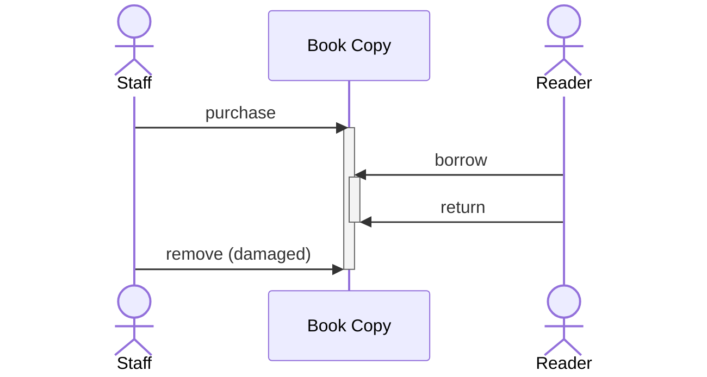

This tutorial will introduce you to the basics of building an application using CQRS,
by teaching you how to _handle commands_, the __C__ in CQRS. You'll be implementing
a command handler for a _library_ application. Spring Boot will be used to
expose the command via REST.

## The Library Domain

For this and any further tutorials of this [Getting Started](../README.md) series, you'll be
implementing an application for a _library_ domain. The domain primarily consists of __books__, 
each of them representing a physical copy. Two different actors are part of the domain:

1.  __Staff__ is managing the book inventory, that is buying new book copies and adding them to
    the stock or replacing or removing damaged books, if necessary.
2.  __Readers__ represent the library's customers. They borrow book copies from the library and have
    to return them within a predefined time period, to avoid overdue fines.

The following diagram depicts the __book__ life-cycle and possible interactions.



The [CQRS/ES Spring Boot application](../01_setup/index.md) will be extended to support the book inventory
management, book lending and return, as well as browsing the stock for available book copies.

## Defining a Command for Purchasing Books

A _command_ expresses the intent to trigger actions within the domain. Accordingly, we can express
new book copies being purchased by the staff and added to the book inventory using a `PurchaseBookCommand`.
The command can be created as Java record within `src/main/java/com/example/cqrs`: 

```java
package com.example.cqrs;

import com.opencqrs.framework.command.Command;
import java.util.UUID;

public record PurchaseBookCommand(
        UUID id,
        String isbn,
        String title,
        String author,
        Long numPages
) implements Command {

    @Override
    public String getSubject() {
        return "/books/" + id();
    }
}
```

It needs to inherit `Command`{ title="com.opencqrs.framework.command.Command" } and implement its `getSubject()` method
to uniquely identify the book copy by means of a unique, path-like id, the so-called _subject_.


## Implementing the Command Handling Logic

The business logic for book copy purchases needs to be implemented within a command handler, which receives the 
`PurchaseBookCommand`. It can be declared using a `@CommandHandling`{ title="com.opencqrs.framework.command.CommandHandling" } 
annotated method within any class annotated with `@CommandHandlerConfiguration`{ title="com.opencqrs.framework.command.CommandHandlerConfiguration" } (1).
{ .annotate }

1. which itself is meta-annotated with Spring's `@Configuration` annotation

Create the command-handling method and its containing class `BookHandling` as follows:
```java
package com.example.cqrs;

import com.opencqrs.framework.command.*;

@CommandHandlerConfiguration
public class BookHandling {

    @CommandHandling
    public void handle(PurchaseBookCommand command, CommandEventPublisher<Void> publisher) {
        // ...
    }
}
```

Handling a command implies publishing _events_, if the command is valid. The `CommandEventPublisher`{ title="com.opencqrs.framework.command.CommandEventPublisher" }
can be used to publish `BookPurchasedEvent` events, representing book copies being added to the inventory. Create a
new Java record for the event, as follows:

```java
package com.example.cqrs;

import java.util.UUID;

public record BookPurchasedEvent(
        UUID id,
        String isbn,
        String title,
        String author,
        Long numPages
) {}
```

Finally, extend the command handler to publish a new `BookPurchasedEvent` based on the
input data from the `PurchaseBookCommand`:

```java hl_lines="10-18"
package com.example.cqrs;

import com.opencqrs.framework.command.*;

@CommandHandlerConfiguration
public class BookHandling {

    @CommandHandling
    public void handle(PurchaseBookCommand command, CommandEventPublisher<Void> publisher) {
        publisher.publish(
                new BookPurchasedEvent(
                        command.id(),
                        command.isbn(),
                        command.title(),
                        command.author(),
                        command.numPages()
                )
        );
    }
}
```

## Accepting Commands via REST

Next you need to create an appropriate Spring REST API controller to accept commands from
clients. The `PurchaseBookCommand` can directly be used as HTTP `@RequestBody` for `POST` requests
to `/books/purchase`. It is then sent to the (auto-wired) `CommandRouter`{ title="com.opencqrs.framework.command.CommandRouter" }
to _route_ it to the command handler.

Create the REST controller as follows:

```java
package com.example.cqrs;

import com.opencqrs.framework.command.CommandRouter;
import org.springframework.web.bind.annotation.*;

@RestController
@RequestMapping("/books")
public class BookController {

    private final CommandRouter commandRouter;

    public BookController(CommandRouter commandRouter) {
        this.commandRouter = commandRouter;
    }

    @PostMapping("/purchase")
    public void purchase(@RequestBody PurchaseBookCommand command) {
        commandRouter.send(command);
    }
}
```

## Testing the Application

Finally, after [starting the Event-Sourcing DB](../01_setup/index.md#running-the-event-sourcing-db) and our 
[application](../01_setup/index.md#running-the-application), new book copies for the library may be purchased
using the REST API, for instance as follows:

=== ":simple-linux: Linux / :simple-apple: MacOS"
    ```shell
    curl --request POST \
         --url "http://localhost:8080/books/purchase" \
         --header "Content-Type: application/json" \
         --data '{
                  "id": "ab9c7d71-9a5e-4664-8b75-73f4d04cac5e",
                  "isbn": "978-0008471286",
                  "title": "Lord of the Rings",
                  "author": "JRR Tolkien",
                  "numPages": 1248
                }'
    ```

=== " :fontawesome-brands-windows: Windows"
    ```shell
    curl --request POST ^
         --url "http://localhost:8080/books/purchase" ^
         --header "Content-Type: application/json" ^
         --data '{
                  "id": "ab9c7d71-9a5e-4664-8b75-73f4d04cac5e",
                  "isbn": "978-0008471286",
                  "title": "Lord of the Rings",
                  "author": "JRR Tolkien",
                  "numPages": 1248
                }'
    ```

To verify the command was handled properly and a new event was published successfully,
the Event-Sourcing DB may be queried, as follows:

=== ":simple-linux: Linux / :simple-apple: MacOS"
    ```shell
    curl --request POST \
         --url "http://localhost:3000/api/read-events" \
         --header "Authorization: Bearer secret" \
         --data '{ 
                  "subject": "/", 
                  "options": { 
                        "recursive": true
                  } 
                }'
    ```

=== " :fontawesome-brands-windows: Windows"
    ```shell
    curl --request POST ^
         --url "http://localhost:3000/api/read-events" ^
         --header "Authorization: Bearer secret" 
         --data '{ 
                  "subject": "/", 
                  "options": { 
                        "recursive": true
                  } 
                }'
    ```

The formatted output of the resulting JSON event (list) will look similar to the following, with the
relevant data resulting from the `BookPurchasedEvent` publication highlighted:
```json hl_lines="5-7 15-21"
{
  "type": "item",
  "payload": {
    "event": {
      "source": "library-service",
      "subject": "/books/ab9c7d71-9a5e-4664-8b75-73f4d04cac5e",
      "type": "com.example.cqrs.BookPurchasedEvent",
      "specversion": "1.0",
      "id": "0",
      "time": "2025-02-05T07:33:57.972491423Z",
      "datacontenttype": "application/json",
      "predecessorhash": "0000000000000000000000000000000000000000000000000000000000000000",
      "data": {
        "metadata": {},
        "payload": {
          "author": "JRR Tolkien",
          "id": "ab9c7d71-9a5e-4664-8b75-73f4d04cac5e",
          "isbn": "978-0008471286",
          "numPages": 1248,
          "title": "Lord of the Rings"
        }
      }
    },
    "hash": "add0e0de5a7bc7d66124cfc41e4a87127575399e1c14e0d378b14752549a7c6f"
  }
}
```

You have now successfully created your first CQRS command handler, exposed it via REST, and published 
events to the event store.